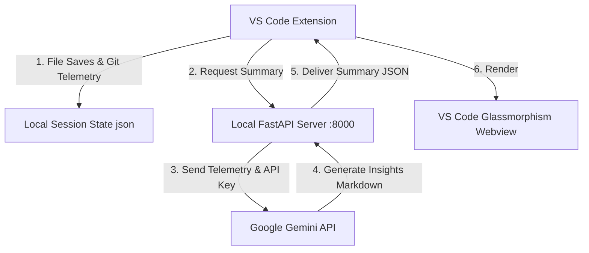

#  CodeCompassAI

**CodeCompassAI** is a local-first, context-aware developer assistant built as a VS Code extension. It is designed to act as your personal "code memory assistant" to solve a common developer pain point: losing workflow context after stepping away from a project. 

Whether you took a break for a couple of hours or a few days, CodeCompassAI helps you instantly resume your coding session by tracking your file edits, capturing git changes, and utilizing Google Gemini to generate structured, actionable guides on what you were doing and what to do next.

---

##  The Problem & The Solution

**The Problem:** Context switching is expensive. When developers return to a project after a break, they often spend 15–30 minutes reading through files, reviewing recent git logs, and asking themselves: *“What was I doing? Why did I change this code? Where was I heading next?”*

**The Solution:** CodeCompassAI running quietly in VS Code. It automatically monitors your file telemetry and active workspace diffs. When you return, it leverages `gemini-2.5-flash-lite` to synthesize a concise, structured dashboard explaining your previous intent and outlining your next immediate tasks.

---

##  Key Features

*   **  Active Session Telemetry:** Automatically tracks your file saves, timestamps, and active workspace files while dynamically ignoring `node_modules`, build directories (`out/`, `dist/`), and configuration files.
*   **  Git & Code Snippet Analysis:** Programmatically captures your unstaged and staged git changes, along with the last 1,500 characters of your last active file, to give the AI engine deep workspace context.
*   ** Gemini AI Insights:** Uses Google's Gemini API to analyze session data and produce a structured Markdown report featuring:
    *   ** Summary:** A clear explanation of what code was recently added or modified.
    *   ** Intent:** The logical or architectural goal behind those changes.
    *   ** Actionable Next Steps:** Precise, bulleted tasks to help you immediately resume work.
*   ** Glassmorphism Dashboard:** A custom-designed VS Code Webview panel showing session stats (Total Saves, Most Edited File), recent activity timeline, and AI insights.
*   ** Contextual Resume Notifications:** 3 seconds after VS Code starts, if you worked on the project within the last 48 hours, a non-intrusive notification prompts you to either **Open Summary** or **Resume Work** (instantly opening the last file at your last edit point).
*   ** Secure Token Storage:** Utilizes VS Code's native `SecretStore` to securely store and retrieve your Gemini API key, ensuring no keys are exposed in your code repository.

---

##  Architecture



---

##  Setup & Installation

CodeCompassAI consists of two parts: the **VS Code Extension** and a **Local Python FastAPI Backend** that communicates with the Gemini API.

### 1. Backend Setup (Local FastAPI Server)

Navigate to the `brain/` directory and set up your Python environment:

```bash
# Navigate to backend folder
cd brain

# Install dependencies
pip install fastapi uvicorn google-generativeai pydantic python-dotenv

# Start the FastAPI server
uvicorn ai_server:app --reload
```
The server will start running at `http://127.0.0.1:8000`.

*Note: Make sure the FastAPI server is running in the background when using CodeCompassAI's AI features.*

### 2. VS Code Extension Installation (`.vsix`)

You can install the pre-packaged extension directly into VS Code:

1.  Download the `codecompassai-0.0.1.vsix` file from the repository.
2.  Open **VS Code**.
3.  Go to the **Extensions View** (`Ctrl+Shift+X` or `Cmd+Shift+X`).
4.  Click the `...` (More Actions) menu in the top-right corner.
5.  Select **Install from VSIX...**.
6.  Locate and select the downloaded `codecompassai-0.0.1.vsix` file.

### 3. Configure Gemini API Key

Once installed:
1. Open the VS Code Command Palette (`Ctrl+Shift+P` or `Cmd+Shift+P`).
2. Run the command: `CodeCompass: Set Gemini API Key`.
3. Paste your Gemini API key (starts with `AIzaSy...`). The extension will securely save this key to your VS Code Secret Store.

---

##  Development & Compiling (Optional)

If you wish to modify or build the extension from source:

1.  Navigate to the `codecompassai` directory:
    ```bash
    cd codecompassai
    npm install
    ```
2.  Compile the extension:
    ```bash
    npm run compile
    ```
3.  Press `F5` in VS Code to open a Development Host window to run and test the extension.
4.  To package it back into a `.vsix` file:
    ```bash
    npm run package
    ```

---

##  Contributing & Feedback

This is a personal learning project and is open to suggestions! If you have ideas on optimizing the telemetry tracking, improving the Webview styling, or refining the prompt engineering, feel free to open an issue or submit a pull request.
